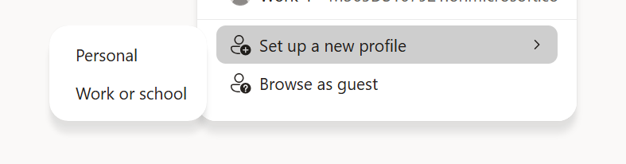
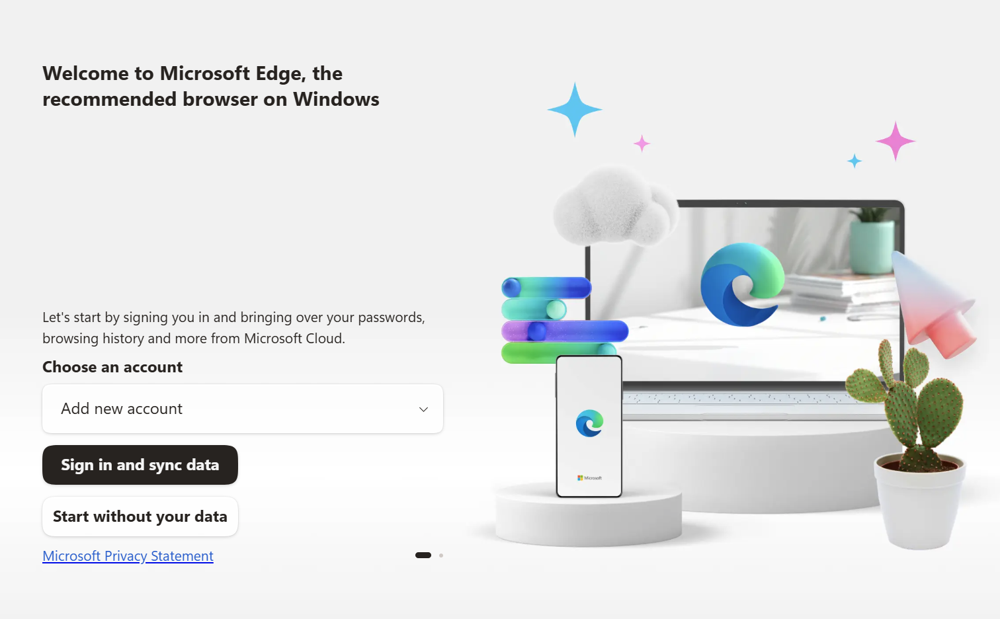
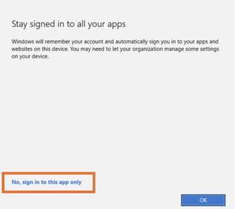
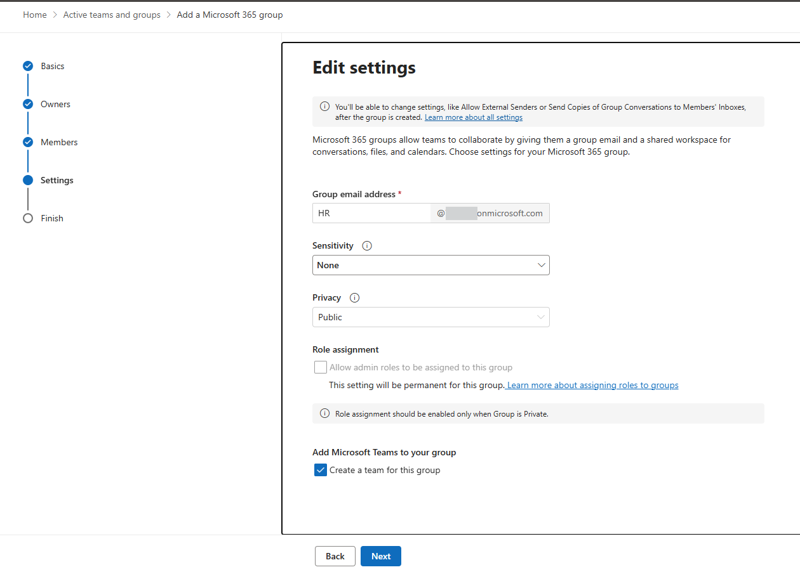
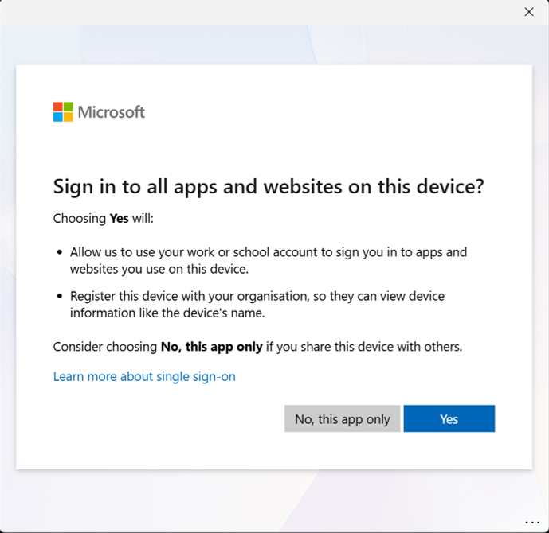

## Create a new Edge profile

Use a dedicated Edge profile for this lab to avoid conflicts with InPrivate browsing and cached sign-in state from your real account.

1. In Microsoft Edge, select your profile icon (top-right corner), then select **Set up a new profile** > **Work or school**.

   

2. Select **Choose an account** > **Add new account**, then select **Sign in to sync data**. Sign in with the credentials you just created and complete the initial MFA setup.

   

3. When prompted "Stay signed in to all your apps", select **No, sign in to this app only** to avoid registering your device in the tenant.

   

4. In Edge profile settings, go to **Profile preferences** and turn on **Automatically sign in to sites with your current work or school account**.

   

    > **Note:** Come back to this guide when you need more user profiles for your demo users.

## M365 Groups Setup

### Create a Microsoft 365 group "HR"

1. Go to [admin.microsoft.com](https://admin.microsoft.com) and sign in with your admin user.
2. In the left navigation, select **Teams & groups** > **Active teams & groups**.
3. Select **+ Add a Microsoft 365 group**.
4. On **Name and description**, enter the following details, then select **Next**:
   - **Name:** `HR`
   - **Description:** This is the private HR group for HR-sensitive communication.
5. Select **+ Assign owners**, search for your admin user, then select **Add**.
6. Add your admin user as a member. _(Optional: also add **Patti Fernandez**.)_
7. On **Settings**, configure:
   - **Group email address:** `HR`
   - **Sensitivity:** None (the label hasn't been published yet)
   - **Privacy:** Private
   - Keep **Add Microsoft Teams to your group** selected.

   

8. Review the settings, then select **Create group**.

### Edit M365 Group U.S. Sales

1. Go to admin.microsoft.com and sign in with your Admin user.
2. In the left navigation, select Teams & groups > Active teams & groups.
3. Choose U.S. Sales, click on Membership and Members and select Nestor Wilke and “Remove as member”. Confirm Remove


## Enable Audit & Sensitivity Labeling for Containers

The PowerShell toolkit in [`scripts/`](scripts/) configures every foundational Purview tenant setting in a single, idempotent run:

- Unified Audit Log ingestion (Exchange Online)
- SharePoint sensitivity-label support (`EnableAIPIntegration`)
- SharePoint PDF sensitivity labels
- Office label co-authoring (`EnableLabelCoauth`)
- Container labels for Microsoft 365 Groups, Teams, and SharePoint sites (`Group.Unified` `EnableMIPLabels`)

> **Recommended:** use Option 2 (the PowerShell orchestrator). It is idempotent, prompts before applying changes, and supports `-WhatIf` for a dry run. Option 1 walks you through the underlying portal/cmdlet steps via Microsoft Learn — useful if you want to learn the manual flow.

### Option 1 — Manual (portal + cmdlets)

References:
- [Turn auditing on or off | Microsoft Learn](https://learn.microsoft.com/purview/audit-log-enable-disable)
- [Use sensitivity labels to protect collaborative workspaces (groups and sites) | Microsoft Learn](https://learn.microsoft.com/purview/sensitivity-labels-teams-groups-sites#how-to-enable-sensitivity-labels-for-containers-and-synchronize-labels)
- [Enable sensitivity labels for Office files in SharePoint and OneDrive | Microsoft Learn](https://learn.microsoft.com/purview/sensitivity-labels-sharepoint-onedrive-files#use-powershell-to-enable-support-for-sensitivity-labels)

1. **Enable Audit.** In **Microsoft Edge**, navigate to [https://purview.microsoft.com](https://purview.microsoft.com/) and sign in as the admin user. Select **Solutions** > **Audit**, then on the **Search** page select the **Start recording user and admin activity** bar. The blue bar should disappear once enabled.

   > **Note:** Initial activation can take up to 24 hours before audit data is fully available.

   

2. **Enable SharePoint sensitivity-label support.** Connect to SharePoint Online PowerShell and run:

   ```powershell
   Set-SPOTenant -EnableAIPIntegration $true
   ```

3. **Enable Office label co-authoring.** Connect to Security & Compliance PowerShell and run:

   ```powershell
   Set-PolicyConfig -EnableLabelCoauth:$true
   ```

4. **Enable container labels.** Follow [Assign sensitivity labels to Microsoft 365 groups in Microsoft Entra ID](https://learn.microsoft.com/azure/active-directory/users-groups-roles/groups-assign-sensitivity-labels) to set `EnableMIPLabels = True` on the `Group.Unified` directory setting via Microsoft Graph.

   > _If your tenant has no group settings created yet, start with [Microsoft Entra cmdlets for configuring group settings](https://learn.microsoft.com/entra/identity/users/groups-settings-cmdlets)._

5. **Synchronize sensitivity labels to Microsoft Entra ID.** From a Security & Compliance PowerShell session, run:

   ```powershell
   Execute-AzureAdLabelSync
   ```

### Option 2 — PowerShell orchestrator (recommended)

#### Prerequisites

- **PowerShell 7+** (`pwsh.exe`). Windows PowerShell 5.1 is not supported — the script hard-fails with an install hint. Install via:
   ```powershell
   winget install --id Microsoft.PowerShell --source winget
   ```
- A **tenant admin account** (Global Administrator, or a combination of Compliance Administrator + SharePoint Administrator + Groups Administrator). Use the tenant that was created earlier ( `admin@<yourtenant>.onmicrosoft.com`).

- Clone this repo or download scripts folder
  
#### Run a dry-run first (recommended)

Open a **fresh `pwsh` window** and preview the changes without touching the tenant:

```powershell
cd <repo-root>\scripts
.\Deploy-TenantBaseline.ps1 -TenantAdminUpn admin@<yourtenant>.onmicrosoft.com  -AutoInstallModules  -WhatIf
```

You will see four browser sign-in prompts (EXO, IPPS, SPO, Graph). Choose **No, this app only** when prompted "Stay signed in to all your apps".



#### Apply the changes

Re-run the same command without `-WhatIf`:

```powershell
cd <repo-root>\scripts
.\Deploy-TenantBaseline.ps1 -TenantAdminUpn admin@<yourtenant>.onmicrosoft.com  -AutoInstallModules
```
You will be asked to confirm `Proceed with deployment? [y/N]`. The script then:

1. Enables Unified Audit Log ingestion (idempotent — skipped if already on).
2. Enables `EnableAIPIntegration` on SharePoint Online.
3. Confirms PDF sensitivity-label support (built-in on current SPO; reported as already enabled).
4. Enables `EnableLabelCoauth` in the IPPS policy config.
5. Sets `EnableMIPLabels = True` on the `Group.Unified` directory setting via Microsoft Graph (Beta).

A summary block prints when the run completes, e.g.:

```
==============================================================================
  Deployment summary  (elapsed: 00:01:49)
==============================================================================
  Tenant settings        OK
==============================================================================
```
