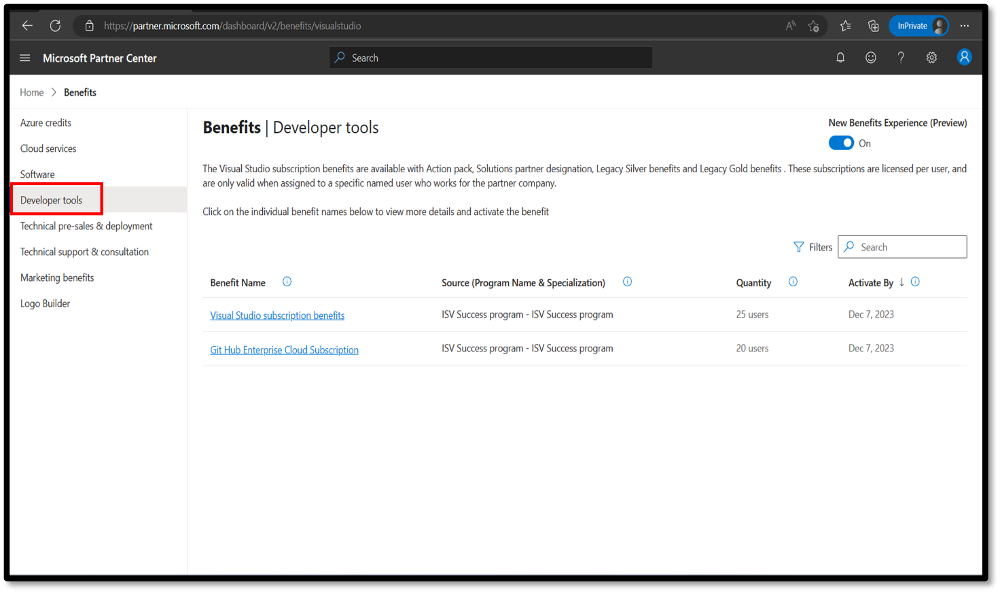

# Assigning Visual Studio Licenses

Reference: [aka.ms/partnerbenefits](https://aka.ms/partnerbenefits)

## Visual Studio Enterprise Subscriptions by Program

| Category | Program / Designation / Specialization | VS Enterprise Subscriptions |
| --- | --- | --- |
| **Partner Benefits Packages** | Partner Launch | 1 |
|  | Partner Success Core | 8 |
|  | Partner Success Expanded | 15 |
| **Solutions Partner Designations** | Business Applications | 25 |
|  | Modern Work | 25 |
|  | Security | 25 |
|  | Data & AI (Azure) | 25 |
|  | Digital & App Innovation (Azure) | 25 |
|  | Infrastructure (Azure) | 25 |
| **ISV Success Program** | ISV Success Core | 25 |
|  | ISV Success Expanded | 25 |
|  | ISV Success Advanced | 25 |
| **Specializations** | Azure Specializations | 10 |
|  | Business Applications Specializations | 10 |
|  | Modern Work Specializations | 10 |
|  | Security Specializations | 10 |

## Activate Microsoft AI Cloud Partner Program Visual Studio benefits

1. Sign in to [Partner Center](https://partner.microsoft.com/dashboard/home) and select **Benefits**.

2. On the **Developer Tools** tab, select **Visual Studio subscriptions benefits**.

   

3. To assign a user the Visual Studio benefit, select the Visual Studio benefit that you want to activate. On the wizard pane, on the **Activate benefits** tab, select a user to which you want to assign the subscription, and then select **Assign user**. If the user you want to assign isn't in the list, you can [add new users](https://learn.microsoft.com/en-us/partner-center/account-settings/create-user-accounts-and-set-permissions) in **Account settings**.

4. Repeat this process for each subscription that you want to assign. Users can manage their subscriptions in the Visual Studio portal:

   1. To view all assigned users to all the Visual Studio subscriptions, select the **View and remove assigned users** tab.

   2. To remove users assigned to any active Visual Studio subscription, select the **View and remove assigned users** tab. Select **Remove** next to the name of the user that you want to remove.

   3. To reassign a Visual Studio subscription from one user to another, select **Reassign user**. For this option to appear, 90 days must pass from the time that the subscription was activated. For more information, read the [Microsoft Partner Programs Guide](https://aka.ms/partner-benefits-use-guide).

## How to access these benefits as a user

1. Partner Program admins in Partner Center assign Visual Studio Enterprise IDE licenses to users. After the licenses are assigned, users activate and sign in to the IDE by using their work email.

2. The [Visual Studio subscriptions portal](https://my.visualstudio.com/) serves as the access portal for Visual Studio-related Partner Program benefits. The benefits are defined by Partner Program eligibility rather than Visual Studio subscription tiers.
