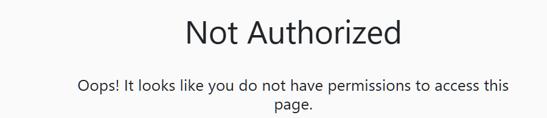

# Create a CDX environment

1. Go to [Microsoft Demo eXperiences](https://cdx.transform.microsoft.com/).
2. Create a **Microsoft Purview Data Security Demo Tenant — 90d**.

   

# Troubleshooting

## If you get a "Not authorized" error when creating the CDX environment as in the screenshot below:

Follow these steps:

1. Consent to the necessary permissions by following [this link](https://login.microsoftonline.com/common/oauth2/authorize?response_type=id_token&prompt=consent&client_id=fe6aa35b-7da8-44fd-a44e-e2d4bafbdab5&redirect_uri=https%3A%2F%2Fcdx.transform.microsoft.com&state=a9985c9c-6c9a-4b65-a444-1e3aa90d27a4&client-request-id=6b3f4e71-ed02-406c-96f2-0a7e3c16ea98&x-client-SKU=Js&x-client-Ver=1.0.17&nonce=09492f5a-fb1a-412c-b24a-ba1704900924) and selecting **Accept**.
2. CDX requires third-party cookies. Some browsers block third-party cookies in some sessions:
   - Check your browser settings and allow cookies from [(https://cdx.transform.microsoft.com/](https://cdx.transform.microsoft.com/).
   - **Edge** and **Chrome** are the only supported browsers — issues may occur with unsupported browsers. 
