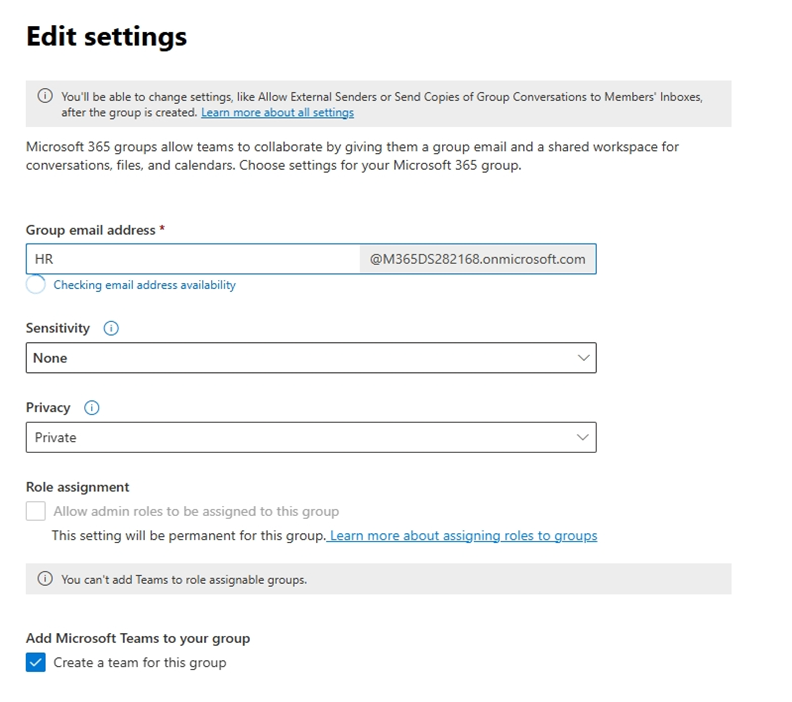
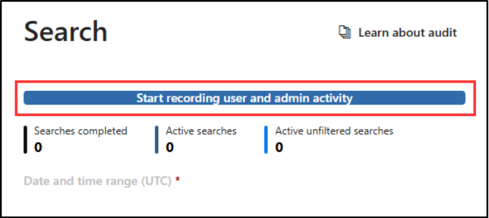

# Create the HR Microsoft 365 group

1. Go to [admin.microsoft.com](https://admin.microsoft.com) and sign in as the **MOD Administrator**.
2. In the left navigation, select **Teams & groups** > **Active teams & groups**.
3. Select **+ Add a Microsoft 365 group**.
4. On **Name and description**, enter the following details, then select **Next**:
   - **Name:** `HR`
   - **Description:** This is the private HR group for HR-sensitive communication.
5. Select **+ Assign owners**, search for **MOD Administrator**, then select **Add**.
6. Add **MOD Administrator** as a member. *(Optional: also add **Diego Siciliani** as a member.)*
7. On **Settings**, configure:
   - **Group email address:** `HR`
   - **Sensitivity:** None *(the label hasn't been published yet)*
   - **Privacy:** Private
   - Keep **Add Microsoft Teams to your group** selected.
8. Review the settings, then select **Create group**.

   

# Enable Audit

1. In **Microsoft Edge**, navigate to [https://purview.microsoft.com](https://purview.microsoft.com/) and sign in as **MOD Administrator**.
2. Select **Solutions** in the left sidebar, then select **Audit**.
3. On the **Search** page, select the **Start recording user and admin activity** bar to enable audit logging. Once enabled, the blue bar disappears from the page.

   

> **Note:** The banner may take a few hours to disappear. You don't need to wait in the portal for it to go away.

# Migrate to the modern label scheme

1. In Microsoft Purview, go to **Solutions** > **Information Protection** > **Sensitivity labels**.
2. On the **Sensitivity labels** page, if you see the information banner **Migrate to the modern label scheme**, label migration is available to your tenant. From the banner, select **Get started** to begin the migration.

   > **Note:** The banner may appear simply as a **Migrate** button.

   

   

# Activate the default label scheme

1. Navigate to Data Security Posture Management > Actions > Setup tasks.
2. Select "Protect your data with sensitivity labels" to activate the default label scheme.
3. Allow up to 24 hours for the labels to appear across all apps and services.

# Enable sensitivity labels for Office files in SharePoint and OneDrive

1. Go to [purview.microsoft.com](https://purview.microsoft.com/) > **Solutions** > **Information Protection**.
2. Under **Sensitivity labels**, if you see this message, select **Turn on now**:

   > *"Your organization has not turned on the ability to process content in Office online files that have encrypted sensitivity labels applied and are stored in OneDrive and SharePoint. You can turn on here, but note that additional configuration is required for Multi-Geo environments."*

   

> **Note:** If you don't see this banner, the feature is already enabled.
