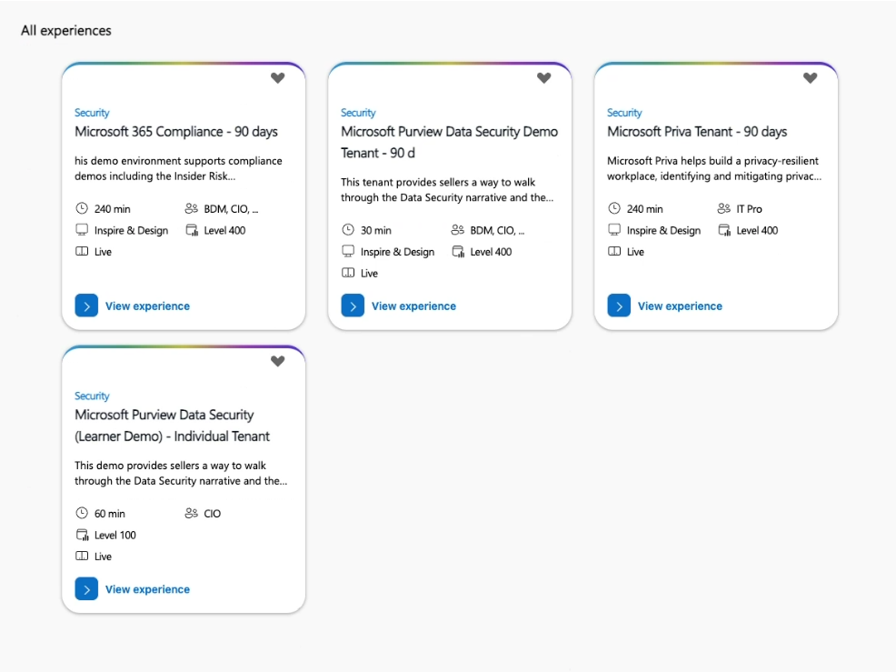
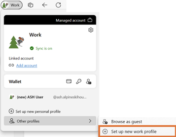
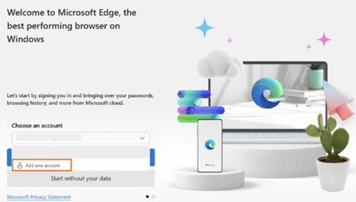
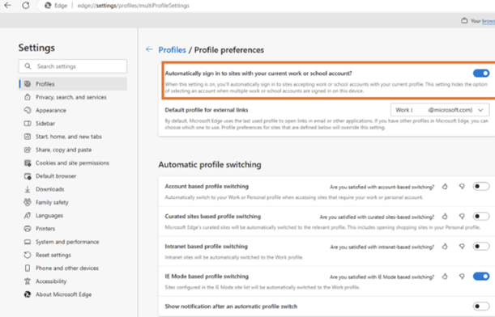
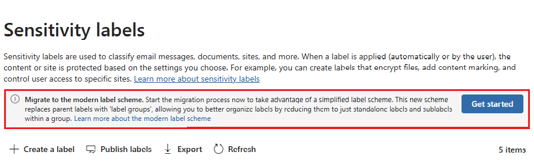
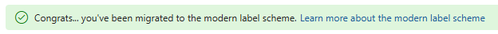
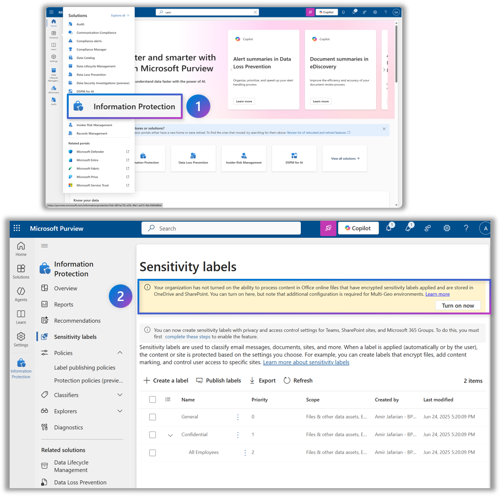

# Before the Lab — CDX/MDX tenant

Set up a Microsoft Customer Demo Experience (CDX) tenant for the Data Security Hack lab. By the end of this guide your tenant has the HR group, audit logging, and the modern sensitivity-label scheme in place.

## Tasks

- [ ] Create a CDX environment
- [ ] Create separate Microsoft Edge profiles
- [ ] Create the HR Microsoft 365 group
- [ ] Enable Audit
- [ ] Migrate to the modern label scheme
- [ ] Enable sensitivity labels for Office files in SharePoint and OneDrive

## Create a CDX environment

1. Go to [Microsoft Demo eXperiences](https://cdx.transform.microsoft.com/).

2. Create a **Microsoft Purview Data Security Demo Tenant — 90d**.

   

> **Note:** If you get a *"Not authorized"* error while creating the CDX environment, see [Troubleshooting](#troubleshooting) at the bottom of this page.

## Create Edge profiles

Create separate Microsoft Edge profiles for the following test users so that sign-in state and MFA tokens don't collide:

- **Tenant administrator:** `admin@<TenantName>.onmicrosoft.com`
- **User:** `nestorw@<TenantName>.onmicrosoft.com`
- **User:** `irvins@<TenantName>.onmicrosoft.com`

### Steps to create each profile

Use a dedicated Edge profile per user to avoid conflicts with InPrivate browsing and cached sign-in state.

1. In Microsoft Edge, select your profile icon, then select **Add profile**.

   

2. Select **Add an account**, then select **Sign in to sync data**. Sign in with the credentials provided in the lab email and complete the initial MFA setup.

   

3. When prompted **"Stay signed in to all your apps"**, select **No, sign in to this app only** to avoid registering your device in the tenant.

   

   

> **Tip:** Repeat for each user (admin, Nestor, Irvin) so you can switch tenants quickly during the lab.

## Create the HR Microsoft 365 group

1. Go to [admin.microsoft.com](https://admin.microsoft.com) and sign in as the **MOD Administrator**.

2. In the left navigation, select **Teams & groups** > **Active teams & groups**.

3. Select **+ Add a Microsoft 365 group**.

4. On **Name and description**, enter the following details, then select **Next**:
   - **Name:** `HR`
   - **Description:** This is the private HR group for HR-sensitive communication.

5. Select **+ Assign owners**, search for **MOD Administrator**, then select **Add**.

6. Add **MOD Administrator** as a member. *(Optional: also add **Diego Siciliani** as a member.)*

7. On **Settings**, configure:
   - **Group email address:** `HR`
   - **Sensitivity:** None *(the label hasn't been published yet)*
   - **Privacy:** Private
   - Keep **Add Microsoft Teams to your group** selected.

8. Review the settings, then select **Create group**.

   

## Enable Audit

1. In **Microsoft Edge**, navigate to [https://purview.microsoft.com](https://purview.microsoft.com/) and sign in as **MOD Administrator**.

2. Select **Solutions** in the left sidebar, then select **Audit**.

3. On the **Search** page, select the **Start recording user and admin activity** bar to enable audit logging. Once enabled, the blue bar disappears from the page.

   

> **Note:** The banner may take a few hours to disappear. You don't need to wait in the portal for it to go away.

## Migrate to the modern label scheme

1. In Microsoft Purview, go to **Solutions** > **Information Protection** > **Sensitivity labels**.

2. On the **Sensitivity labels** page, if you see the information banner **Migrate to the modern label scheme**, label migration is available to your tenant. From the banner, select **Get started** to begin the migration.

   > **Note:** The banner may appear simply as a **Migrate** button.

   

   

## Enable sensitivity labels for Office files in SharePoint and OneDrive

1. Go to [purview.microsoft.com](https://purview.microsoft.com/) > **Solutions** > **Information Protection**.

2. Under **Sensitivity labels**, if you see this message, select **Turn on now**:

   > *"Your organization has not turned on the ability to process content in Office online files that have encrypted sensitivity labels applied and are stored in OneDrive and SharePoint. You can turn on here, but note that additional configuration is required for Multi-Geo environments."*

   

> **Note:** If you don't see this banner, the feature is likely already enabled.

## Troubleshooting

### "Not authorized" error when creating the CDX environment

Follow these steps:

1. Consent to the necessary permissions by following [this link](https://login.microsoftonline.com/common/oauth2/authorize?response_type=id_token&prompt=consent&client_id=fe6aa35b-7da8-44fd-a44e-e2d4bafbdab5&redirect_uri=https%3A%2F%2Fcdx.transform.microsoft.com&state=a9985c9c-6c9a-4b65-a444-1e3aa90d27a4&client-request-id=6b3f4e71-ed02-406c-96f2-0a7e3c16ea98&x-client-SKU=Js&x-client-Ver=1.0.17&nonce=09492f5a-fb1a-412c-b24a-ba1704900924) and selecting **Accept**.

2. CDX requires third-party cookies. Some browsers block third-party cookies in some sessions:
   - Check your browser settings and allow cookies from [cdx.transform.microsoft.com](https://cdx.transform.microsoft.com/).
   - **Edge** and **Chrome** are the only supported browsers — issues may occur with unsupported browsers.
