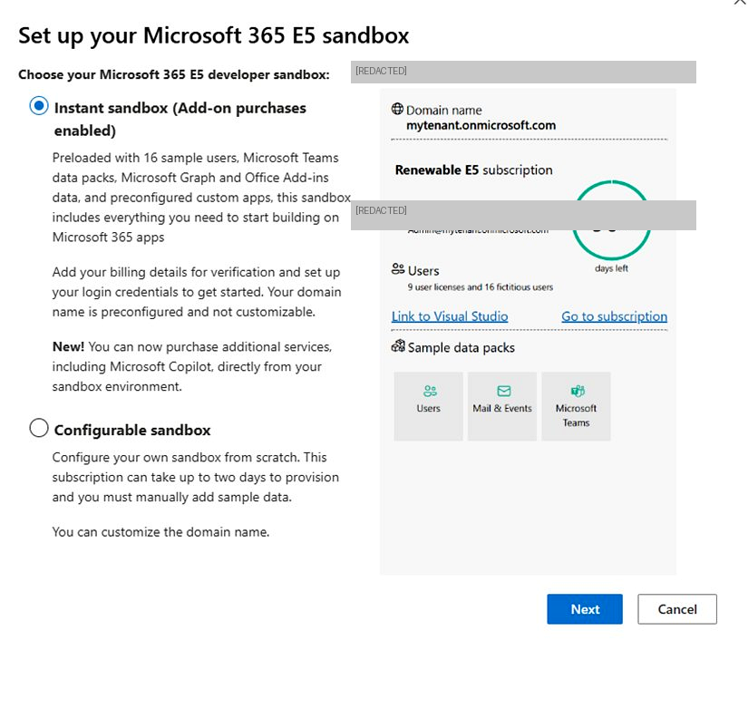
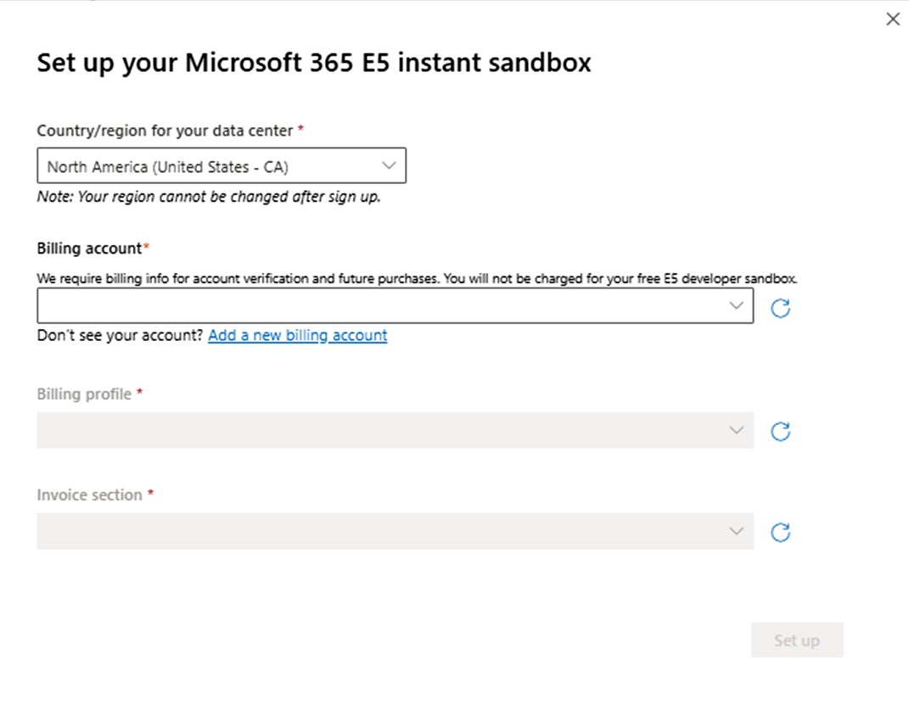
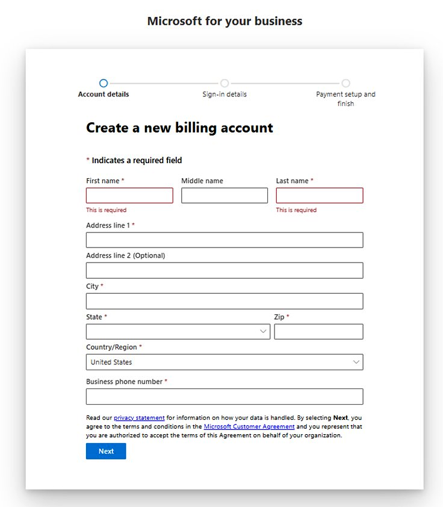
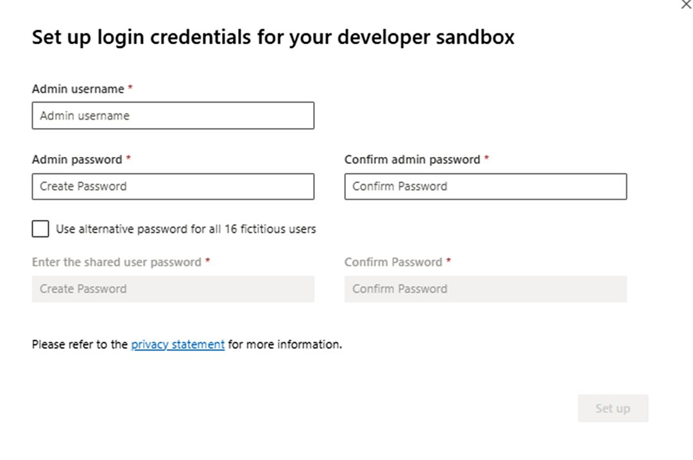
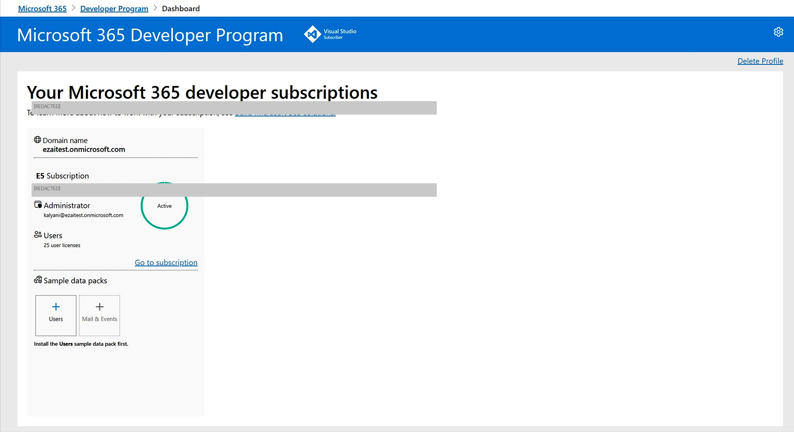

# Set up your Microsoft 365 E5 Instant Sandbox

The Microsoft 365 Developer Program **Instant Sandbox** is a fully pre-configured E5 developer environment that provisions in minutes, pre-loaded with 16 fictitious sample users, Microsoft Teams data packs, Microsoft Graph and Office Add-ins data, and pre-configured custom apps. The Instant Sandbox now also supports **add-on commerce**, so you can purchase additional services (including Microsoft Copilot) directly from within the sandbox.

For more information, see the [Microsoft 365 Developer Program documentation](https://developer.microsoft.com/microsoft-365/dev-program).

> **Important:** You will not be charged for the free E5 developer sandbox. Billing details are required only for account verification and to enable future add-on purchases.

## Prerequisites

- A Microsoft account to sign in to the [Microsoft 365 Developer Program](https://developer.microsoft.com/microsoft-365/dev-program).
- A valid billing account (you can create one during setup if needed).
- A business phone number and address for billing account creation.

## Step 1: Choose your sandbox type

1. Sign in to the [Microsoft 365 Developer Program](https://developer.microsoft.com/microsoft-365/dev-program) dashboard and select **Set up E5 sandbox**.

2. In the setup dialog, select **Instant sandbox (Add-on purchases enabled)** — this is the top option and should already be selected by default.

   

   > **Note:** Your domain name will be pre-configured (e.g., `yourtenant.onmicrosoft.com`) and **cannot be customised** after sign-up. The preview panel on the right shows the 90-day renewable subscription details.

3. Select **Next** to proceed to the billing setup screen.

## Step 2: Configure billing details

On the **Set up your Microsoft 365 E5 instant sandbox** screen, you provide your data centre region and link a billing account.

### 2a. Select country/region

From the **Country/region for your data center** dropdown, choose the region geographically closest to you.

> **Note:** This selection is **permanent** and cannot be changed after sign-up. Billing account creation from within the sandbox at later stages will only be supported for the region you select here, so choose carefully.

### 2b. Select a billing account

> **Note:** This is an automated fetch from Azure. If there are any valid billing accounts associated with the email address used to log in, will appear in the dropdown for the user to select.

Select the **Billing account** dropdown. If you have an existing billing account associated with your Microsoft account, it will appear in the list — select it and skip to **Step 2d**.

If the dropdown is empty or your account is not listed, create a new billing account (continue with **Step 2c**).

### 2c. Create a new billing account (if required)

1. Select **Add a new billing account** below the dropdown. This opens the *Microsoft for your business* billing account creation flow in a new window.

   

2. Complete all required fields across the three-step wizard:

   1. **Account details** — Enter your first name, last name, business address, country/region, and business phone number.
   2. **Sign-in details** — Confirm or set up your sign-in credentials for the billing account.
   3. **Payment setup and finish** — Review and accept the Microsoft Customer Agreement, then complete the wizard.

   > **Note:** By selecting **Next**, you agree to the Microsoft Customer Agreement and confirm that you are authorized to accept its terms on behalf of your organization.

3. Once billing account creation is complete, close that window and return to the sandbox setup screen.

### 2d. Refresh and select your billing account

1. On the setup screen, select the small **Refresh (↺)** icon next to the **Billing account** dropdown. Your newly created billing account will now appear in the list.

   > **Tip:** If your account still does not appear after refreshing, wait a few seconds and try again.

2. Select your billing account from the dropdown. The **Billing profile** and **Invoice section** fields populate automatically. Verify they are correct, then select **Set up**.

## Step 3: Set up admin credentials

After the billing configuration is saved, you are prompted to set login credentials for your developer sandbox.

1. Fill in the following fields:
   - **Admin username** — Choose a username for your sandbox administrator account.
   - **Admin password** / **Confirm admin password** — Create and confirm a strong password for the admin account.

2. *(Optional)* Select **Use alternative password for all 16 fictitious users** if you want to set a shared password for the sample user accounts. This is useful for testing scenarios where you need to sign in as different users.

3. Select **Set up** to begin provisioning your sandbox.

## Step 4: Access your sandbox dashboard

Once provisioning is complete, you are redirected to the Microsoft 365 Developer Program dashboard. Your new sandbox subscription is displayed with an **Active** status.

From the dashboard you can:

- View your sandbox domain name and subscription status.
- Access your sandbox via **Go to subscription**.
- Install sample data packs (**Users**, **Mail & Events**) — note that the **Users** pack must be installed first.
- Monitor the 90-day renewable subscription timer.

> **Tip:** Visual Studio subscribers benefit from automatic renewal of their E5 subscription, as shown in the dashboard.

# Troubleshooting

- **Billing account not appearing in dropdown** — Select the **Refresh (↺)** icon next to the **Billing account** dropdown. Allow a few seconds after completing billing account creation before refreshing.
- **Set up button remains greyed out** — Ensure all required fields (**Billing account**, **Billing profile**, and **Invoice section**) are selected. All three dropdowns must have a value before the **Set up** button becomes active.
- **Provisioning takes longer than expected** — The Instant Sandbox typically provisions within minutes. If it takes longer, refresh the Developer Program dashboard. If the issue persists, contact Microsoft 365 Developer Program support.
